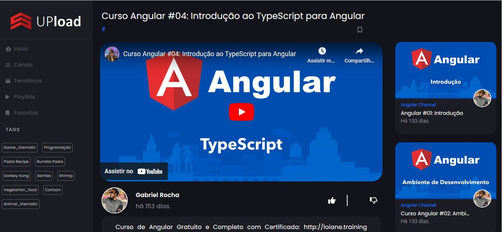
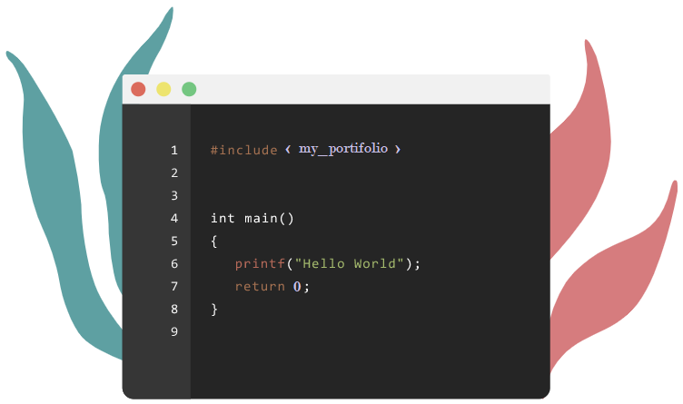

# 🚀 Karoline Rocha - Portfolio

<div align="center">


**Modern Full-Stack Developer Portfolio**  
*Crafting Digital Experiences with Elegance & Innovation*

[](https://angular.io/)
[](https://www.typescriptlang.org/)
[](https://sass-lang.com/)
[](https://developer.mozilla.org/en-US/docs/Learn/CSS/CSS_layout/Responsive_Design)

[🌐 **Live Demo**](https://karolinerrocha.github.io/karoline-rocha-portifolio/) • [📧 **Contact**](mailto:karoline.rrocha@gmail.com) • [💼 **LinkedIn**](https://www.linkedin.com/in/karoline-rrocha/)

</div>

---

## 📋 Table of Contents

- [✨ Overview](#-overview)
- [🎯 Features](#-features)
- [🖼️ Screenshots](#️-screenshots)
- [🛠️ Tech Stack](#️-tech-stack)
- [🚀 Getting Started](#-getting-started)
- [🏗️ Architecture](#️-architecture)
- [🎨 Design System](#-design-system)
- [📱 Responsive Design](#-responsive-design)
- [🔧 Configuration](#-configuration)
- [🚀 Deployment](#-deployment)
- [🤝 Contributing](#-contributing)
- [📞 Contact](#-contact)

---

## ✨ Overview

A **modern, responsive portfolio website** built with **Angular 16** and **TypeScript**, showcasing my expertise in frontend development through elegant design, smooth animations, and interactive user experiences.

### 🎯 **What Makes This Portfolio Special**

- **🎨 Modern Aesthetics** - Clean, professional design with smooth animations
- **📱 Mobile-First Approach** - Optimized for all devices and screen sizes
- **⚡ Performance Optimized** - Fast loading times and smooth interactions
- **🔧 Admin Management** - Secure project management system
- **📧 Seamless Communication** - Integrated contact forms with EmailJS
- **🎭 Enhanced UX** - Custom notifications and intuitive navigation

---

## 🎯 Features

### 🎨 **Design & User Experience**
| Feature | Description |
|---------|-------------|
| **Floating Elements** | Animated code brackets for visual appeal |
| **Interactive Code Window** | Terminal-style code display with typing animations |
| **Smooth Transitions** | CSS animations and micro-interactions |
| **Modern Typography** | Clean, readable font hierarchy |
| **Professional Color Scheme** | Purple/blue gradient theme |

### 📱 **Responsive Design**
| Device | Features |
|--------|----------|
| **Mobile** | Touch-optimized, compact layout |
| **Tablet** | Adaptive navigation, optimized spacing |
| **Desktop** | Enhanced features, larger interactions |
| **Large Screens** | Full-width layouts, advanced animations |

### 🔧 **Technical Excellence**
| Aspect | Implementation |
|--------|---------------|
| **Component Architecture** | Modular, reusable Angular components |
| **Service Layer** | Clean separation of concerns |
| **Form Validation** | Reactive forms with custom validators |
| **Route Protection** | Secure admin routes with guards |
| **Performance** | Lazy loading and optimization |

### 👨‍💼 **Admin Features**
| Capability | Details |
|------------|---------|
| **Secure Authentication** | Environment-based credentials |
| **Project Management** | CRUD operations for projects |
| **Image Handling** | Upload and manage project images |
| **Real-time Updates** | Instant UI synchronization |

---

## 🖼️ Screenshots

<div align="center">

### 🏠 **Home Page - Hero Section**


*Modern hero section with interactive code window and floating elements*

### 💻 **Interactive Code Display**


*Terminal-style code window with typing animations*

### 📂 **Projects Showcase**


*Responsive project grid with admin management capabilities*

### 🛠️ **Technologies Stack**


*Comprehensive technology showcase with categorized display*

</div>

---

## 🛠️ Tech Stack

### **Frontend Framework**
<div align="center">

 

**Angular 16** - Modern web framework with TypeScript  
**TypeScript** - Type-safe JavaScript development

</div>

### **Styling & Design**
<div align="center">

  

**SCSS** - Advanced CSS preprocessing  
**CSS3** - Modern styling features  
**HTML5** - Semantic markup structure

</div>

### **Backend & Integration**
<div align="center">

 

**Laravel** - PHP backend framework  
**EmailJS** - Client-side email integration

</div>

### **Development Tools**
<div align="center">

  

**Git** - Version control system  
**GitHub** - Code hosting and collaboration  
**Angular CLI** - Development and build tools

</div>

---

## 🚀 Getting Started

### **Prerequisites**
- Node.js (v16 or higher)
- npm or yarn package manager
- Git version control

### **Installation Steps**

#### **1. Clone the Repository**
```bash
git clone https://github.com/KarolineRRocha/karoline-rocha-portifolio.git
cd karoline-rocha-portifolio
```

#### **2. Install Dependencies**
```bash
npm install
```

#### **3. Environment Configuration**
Create environment files for your configuration:

```typescript
// src/environments/environment.ts
export const environment = {
  production: false,
  adminCredentials: {
    username: 'your-admin-username',
    password: 'your-admin-password'
  },
  emailjsConfig: {
    serviceId: 'your-emailjs-service-id',
    templateId: 'your-emailjs-template-id',
    publicKey: 'your-emailjs-public-key'
  },
  githubConfig: {
    username: string,
    apiUrl: string
  }
};
```

#### **4. Start Development Server**
```bash
npm start
```

Navigate to `http://localhost:4200/` to view the application.

#### **5. Build for Production**
```bash
npm run build
```

---

## 🏗️ Architecture

### **Project Structure**
```
src/
├── app/
│   ├── components/              # Reusable UI components
│   │   ├── header/             # Hero section component
│   │   ├── footer/             # Footer component
│   │   ├── topnav/             # Navigation component
│   │   ├── technologies/       # Tech stack display
│   │   ├── latest-projects/    # Featured projects
│   │   └── scroll-top/         # Scroll to top button
│   ├── pages/                  # Main page components
│   │   ├── home-page/          # Landing page
│   │   ├── about-page/         # About section
│   │   ├── project-page/       # Projects showcase
│   │   ├── technologies-page/  # Tech stack page
│   │   └── contact-page/       # Contact form
│   ├── core/                   # Core services and guards
│   │   ├── services/           # Application services
│   │   │   ├── auth.service.ts
│   │   │   ├── projects.service.ts
│   │   │   ├── notification.service.ts
│   │   │   └── github.service.ts
│   │   └── guards/             # Route guards
│   └── shared/                 # Shared modules and components
│       ├── components/         # Shared UI components
│       └── modules/            # Feature modules
├── assets/                     # Static assets (images, icons)
└── styles/                     # Global styles and variables
```

### **Component Architecture**
- **Modular Design** - Each feature is a separate module
- **Service Layer** - Business logic separated from UI
- **Reactive Programming** - RxJS for state management
- **Type Safety** - Full TypeScript implementation

---

## 🎨 Design System

### **Color Palette**
```scss
// Primary Colors
$primary-purple: #2d1b69;      // Deep Purple
$secondary-blue: #4a90e2;      // Blue
$accent-orange: #f39c12;       // Orange

// Neutral Colors
$background-light: #f8f9fa;    // Light Gray
$text-dark: #2c3e50;           // Dark Gray
$text-light: #6c757d;          // Medium Gray

// Semantic Colors
$success: #28a745;             // Green
$warning: #ffc107;             // Yellow
$error: #dc3545;               // Red
```

### **Typography**
```scss
// Font Families
$font-primary: 'Inter', -apple-system, BlinkMacSystemFont, sans-serif;
$font-mono: 'Fira Code', 'Monaco', 'Consolas', monospace;

// Font Sizes
$font-size-xs: 0.75rem;        // 12px
$font-size-sm: 0.875rem;       // 14px
$font-size-base: 1rem;         // 16px
$font-size-lg: 1.125rem;       // 18px
$font-size-xl: 1.25rem;        // 20px
$font-size-2xl: 1.5rem;        // 24px
$font-size-3xl: 1.875rem;      // 30px
```

### **Spacing System**
```scss
// Spacing Scale
$spacing-xs: 0.25rem;          // 4px
$spacing-sm: 0.5rem;           // 8px
$spacing-md: 1rem;             // 16px
$spacing-lg: 1.5rem;           // 24px
$spacing-xl: 2rem;             // 32px
$spacing-2xl: 3rem;            // 48px
```

---

## 📱 Responsive Design

### **Breakpoint Strategy**
```scss
// Standard Breakpoints
$breakpoints: (
  'large-desktop': 1200px,     // Large Desktop
  'desktop': 1024px,           // Desktop
  'tablet-landscape': 900px,   // Tablet Landscape
  'tablet-portrait': 768px,    // Tablet Portrait
  'mobile': 480px,             // Mobile
  'mobile-small': 360px        // Small Mobile
);
```

### **Mobile-First Approach**
- **Base styles** for mobile devices
- **Progressive enhancement** for larger screens
- **Touch-friendly** interactions
- **Optimized performance** for mobile networks

### **Responsive Features**
- **Flexible grids** that adapt to screen size
- **Scalable typography** using relative units
- **Optimized images** with responsive sizing
- **Touch targets** sized for mobile interaction

---

## 🔧 Configuration

### **Environment Setup**
```typescript
// Environment Configuration
export const environment = {
  production: boolean,
  adminCredentials: {
    username: string,
    password: string
  },
  emailjsConfig: {
    serviceId: string,
    templateId: string,
    publicKey: string
  },
  githubConfig: {
    username: string,
    apiUrl: string
  }
};
```

### **Build Configuration**
```json
{
  "scripts": {
    "start": "ng serve",
    "build": "ng build",
    "build:prod": "ng build --configuration=production",
    "deploy:ghdocs": "ng build --configuration=production --output-path docs --base-href /karoline-rocha-portifolio/"
  }
}
```

---

## 🚀 Deployment

### **GitHub Pages Deployment**
```bash
# Build for GitHub Pages
npm run deploy:ghdocs

# Deploy to GitHub Pages
git add docs/
git commit -m "Deploy to GitHub Pages"
git push origin main
```

### **Other Hosting Platforms**
1. **Build the project**: `npm run build:prod`
2. **Upload `dist/` folder** to your hosting provider
3. **Configure domain** and SSL certificates
4. **Set up environment variables** for production

### **Performance Optimization**
- **Code splitting** for faster initial load
- **Image optimization** and lazy loading
- **Minification** and compression
- **CDN integration** for static assets

---

## 🤝 Contributing

We welcome contributions! Please follow these steps:

### **Development Workflow**
1. **Fork** the repository
2. **Create** a feature branch: `git checkout -b feature/amazing-feature`
3. **Commit** your changes: `git commit -m 'Add amazing feature'`
4. **Push** to the branch: `git push origin feature/amazing-feature`
5. **Open** a Pull Request

### **Code Standards**
- Follow **Angular style guide**
- Use **TypeScript** for type safety
- Write **unit tests** for new features
- Update **documentation** as needed

---

## 📞 Contact

<div align="center">

**Let's Connect!** 🤝

[](mailto:karoline.rrocha@gmail.com)
[](https://www.linkedin.com/in/karoline-rrocha/)
[](https://github.com/KarolineRRocha)
[](https://karolinerrocha.github.io/karoline-rocha-portifolio/)

</div>

---

<div align="center">

**Made with ❤️ by Karoline Rocha**

[](https://github.com/KarolineRRocha/karoline-rocha-portifolio)
[](https://github.com/KarolineRRocha/karoline-rocha-portifolio)
[](https://github.com/KarolineRRocha/karoline-rocha-portifolio/issues)
[](https://github.com/KarolineRRocha/karoline-rocha-portifolio/blob/main/LICENSE)

---

**⭐ Star this repository if you found it helpful!**

</div> 
